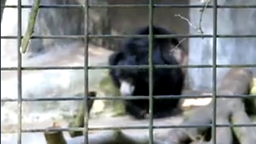

# 在 Rust 中使用 FFmpeg (2)：视频解码测试

在上一篇文章中我们完成了环境搭建，通过一个简单的 API 调用打通了在 Rust 中调用 FFmpeg 的完整路径。这次我们将通过一个简单的示例程序学习如何用 ffmpeg-next 库实现视频解码。

dump-frames, ffmpeg-next 仓库自带的 example，实现了对输入视频文件的逐帧解码，并保存为图像文件的功能。完整的源码在[这里](https://github.com/zmwangx/rust-ffmpeg/blob/master/examples/dump-frames.rs)。

首先，为 `crate ffmpeg_next` 定义别名为 `ffmpeg`，方便使用：
```rust
extern crate ffmpeg_next as ffmpeg;
```

在 `main` 函数入口处例行的初始化：
```
ffmpeg::init().unwrap();
```
这个初始化是必要的，其内部除了调用 ffmpeg 的初始化方法外还初始化了常用错误码的描述信息，这对出错时的调试排障很有帮助。

接下来是个巨大的 `if let` 代码块。`input` 函数负责打开视频文件解析头信息等，文件路径是从命令行参数中获取的。
```rust
if let Ok(mut ictx) = input(&env::args().nth(1).expect("Cannot open file.")) {
  ...
}
```
我们可以看下 `input` 函数的内部实现：
```rust
pub fn input<P: AsRef<Path> + ?Sized>(path: &P) -> Result<context::Input, Error> {
    unsafe {
        let mut ps = ptr::null_mut();
        let path = from_path(path);

        match avformat_open_input(&mut ps, path.as_ptr(), ptr::null_mut(), ptr::null_mut()) {
            0 => match avformat_find_stream_info(ps, ptr::null_mut()) {
                r if r >= 0 => Ok(context::Input::wrap(ps)),
                e => {
                    avformat_close_input(&mut ps);
                    Err(Error::from(e))
                }
            },

            e => Err(Error::from(e)),
        }
    }
}
```
`avformat_open_input` 和 `avformat_find_stream_info`，果然是我们熟悉的 FFmpeg 。这两个函数是 `crate ffmpeg-sys-next` 提供的，我们也可以直接使用 `ffmpeg-sys-next`，不过那样的话需要写大量 `unsafe` 代码，比较麻烦，所以我们在满足需求的前提下优先使用 `ffmpeg-next`。 

接下来的代码依然是熟悉的流程，记录视频流 id，创建解码器，因为最终需要输出的是 RGB 格式的图像所以创建对应的格式转换对象 scaler 。这里也可以不创建 scaler 直接写 YUV 裸数据到文件，然后用 YUView 之类的 YUV 工具软件查看解码结果。
```rust
let input = ictx
    .streams()
    .best(Type::Video)
    .ok_or(ffmpeg::Error::StreamNotFound)?;
let video_stream_index = input.index();

let context_decoder = ffmpeg::codec::context::Context::from_parameters(input.parameters())?;
let mut decoder = context_decoder.decoder().video()?;

let mut scaler = Context::get(
    decoder.format(),
    decoder.width(),
    decoder.height(),
    Pixel::RGB24,
    decoder.width(),
    decoder.height(),
    Flags::BILINEAR,
)?;
```

定义一个闭包用来实现解码转码和写图像文件，因为 `ffmpeg-next` 是高层抽象，所以使用起来比较简单：
```rust
let mut frame_index = 0;

let mut receive_and_process_decoded_frames =
    |decoder: &mut ffmpeg::decoder::Video| -> Result<(), ffmpeg::Error> {
        let mut decoded = Video::empty();
        while decoder.receive_frame(&mut decoded).is_ok() {
            let mut rgb_frame = Video::empty();
            scaler.run(&decoded, &mut rgb_frame)?;
            save_file(&rgb_frame, frame_index).unwrap();
            frame_index += 1;
        }
        Ok(())
    };    
```

解析文件读取音视频帧的过程被抽象成了迭代器，这在 Rust 中是很常见的做法，使用起来也很简单：
```rust
for (stream, packet) in ictx.packets() {
    if stream.index() == video_stream_index {
        decoder.send_packet(&packet)?;
        receive_and_process_decoded_frames(&mut decoder)?;
    }
}
```
不过对于商业强度的播放器项目，现实情况要复杂得多，每帧读取后都有一大串的工作要做，记录信息、处理失败、处理音频和视频的同步、处理 Seek（对应播放器上拖动进度条的操作）等等，这时候迭代器可能就不够用了，仍然需要回归原始的命令式编程一步一步的实现各种处理。

最后是一点收尾工作，取出仍缓存在解码器中的视频帧：
```rust
decoder.send_eof()?;
receive_and_process_decoded_frames(&mut decoder)?;
```

保存每帧图像的代码，使用的 PPM 格式，非常简单的一种图像格式，特别适合用于当前这种简单的示例程序：
```rust
fn save_file(frame: &Video, index: usize) -> std::result::Result<(), std::io::Error> {
    let mut file = File::create(format!("frame{}.ppm", index))?;
    file.write_all(format!("P6\n{} {}\n255\n", frame.width(), frame.height()).as_bytes())?;
    file.write_all(frame.data(0))?;
    Ok(())
}
```
关于 PPM 格式可以参考 Wikipedia 上的文档 [Netpbm](https://en.wikipedia.org/wiki/Netpbm)

编译执行：
```Shell
cargo run --example dump-frames -- "C:\Videos\bear.mp4"
```
用看图软件查看输出的 .ppm 文件：


解码顺利完成，后续我们会在这个代码的基础增加视频渲染到窗口的能力，一步步向着一个正经播放器的样子前进。